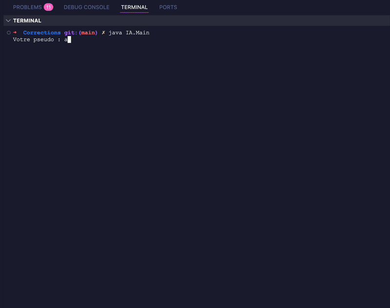

# **Jeu du Morpion avec Intelligence Artificielle Générative et Persistance**

Construire un jeu du morpion en Java, jouable dans la console, dans lequel l'IA joue contre l'utilisateur.
Le jeu doit enregistrer chaque partie dans un fichier texte et organiser le code en plusieurs classes.

Attention vous devez également rédiger un texte qui présente des notions sur l'IA, voyez en fin de page.

---

# Le jeu en console 



# **Structure du TP**

Le projet doit contenir les classes suivantes :

1. **Board** : gestion du plateau
1. **IAServiceInterface** : interface pour l'IA
1. **AiService** : appel à une API d'IA générative
1. **GameEngine** : logique du jeu
1. **Main** : point d'entrée du programme

Le travail consiste à écrire chacune de ces classes en suivant les instructions de ce TP.

Vous avez du code en fin de page pour vous aidez à réaliser le TP.

---

# **Le plateau (Board)**

Créer une classe représentant un plateau 3×3 :

* Le plateau doit être stocké dans un tableau 2D de caractères.
* Une case vide doit contenir un espace `' '`.
* Ajouter une méthode pour afficher le plateau proprement.
* Ajouter une méthode permettant de poser un coup si la case est libre.
* Ajouter une méthode pour vérifier si le plateau est plein.
* Ajouter une méthode pour détecter un gagnant (3 symboles alignés).

Contraintes :

* Les symboles utilisés sont `X` pour l'utilisateur et `O` pour l'IA.
* Retourner un caractère : `'X'`, `'O'` ou `' '` si personne n'a gagné.

---

# **Conception des interfaces**

Créer une interface au choix :

### **IAServiceInterface**

* Contient une méthode permettant d'envoyer une question ou un prompt à une IA générative.
* La méthode renvoie la réponse sous forme de texte simple.

###  **PersistenceService**

* Contient une méthode permettant d'enregistrer une partie dans un fichier ou un stockage quelconque.

Objectif : séparer les responsabilités pour rendre le code évolutif.

---

#  **Appel à une IA Générative (AiService)**

Créer une classe chargée de :

* Construire un prompt décrivant l'état actuel du plateau.
* Envoyer ce prompt à une API d'IA générative via HTTP.
* Rencontrer les éléments suivants :

  * Construction d'un JSON à la main
  * Utilisation de `HttpClient`, `HttpRequest` et `HttpResponse`
  * Nettoyage / échappement des caractères spéciaux
* Récupérer la réponse brute renvoyée par l'IA.
* Extraire un JSON interne du type :

  ```
  {"row":2, "col":1}
  ```
* Transformer ces valeurs en indices utilisables par le plateau (de 0 à 2).

Remarque :
L'API utilisée doit être renseignée dans le TP (par exemple Groq), mais aucune clé ne doit être mise dans l'énoncé.

---

# **Moteur du jeu (GameEngine)**

Créer une classe représentant la boucle de jeu :

1. Demander un pseudo à l'utilisateur.
2. Tant que la partie n'est pas terminée :

   * Afficher le plateau
   * Si c'est au joueur :

     * Demander une ligne et une colonne
     * Vérifier que le coup est valide
   * Si c'est à l'IA :

     * Construire un prompt contenant :

       * L'état actuel du plateau
       * Une consigne demandant un JSON strict
     * Appeler l'IA via `IAServiceInterface`
     * Extraire `row` et `col` de la réponse
     * Jouer le coup
3. Vérifier s'il y a un gagnant ou un match nul.
4. Appeler `PersistenceService` pour enregistrer la partie.
5. Afficher le résultat final.

La gestion du prompt doit être simple :
décrire le plateau et demander un JSON minimal du type :

```
{"row":<ligne>, "col":<colonne>}
```

---

# **Point d'entrée (Main)**

Créer un programme principal qui :

* instancie les implémentations de l'IA et de la persistance
* crée un objet `GameEngine`
* lance la méthode de démarrage du jeu

---

# **Travail attendu**

Le rendu doit comprendre :
* Vos noms prénoms
* Un dossier contenant toutes les classes Java
* Le jeu fonctionnel dans la console
* Un prompt clair envoyé à l'IA
* Une extraction correcte de `row` et `col` depuis la réponse de l'IA
* Une explication brève sur le fonctionnement général du programme

# **Remarques et aides**

Utilisez la classe suivante, vu en cours pour réaliser le TP.

```java
package IA;
import java.net.http.*;
import java.net.*;
import java.io.IOException;

/**
 * Service chargé d'envoyer un prompt à une IA générative
 * et de récupérer sa réponse sous forme de texte.
 * L’implémentation utilise l’API Groq compatible OpenAI.
 */
public class AiService implements IAServiceInterface {

    // Clé API (à remplacer)
    private static final String API_KEY = "XXX";

    /**
     * Envoie un prompt à l’IA et renvoie la réponse brute.
     * @param prompt Le texte que l'on envoie à l'IA
     * @return La réponse JSON complète produite par l’API
     */
    @Override
    public String askAi(String prompt) throws IOException, InterruptedException {

        // Construction manuelle du JSON envoyé à l’API.
        // Le champ "content" doit être échappé pour rester valide.
        String json = "{"
                + "\"model\": \"openai/gpt-oss-20b\","       // Modèle utilisé
                + "\"messages\": ["                         // Format type ChatGPT
                + "    {\"role\": \"user\", \"content\": \"" 
                + escapeJson(prompt) 
                + "\"}"
                + "]"
                + "}";

        // Construction de la requête HTTP envoyée à Groq
        HttpRequest request = HttpRequest.newBuilder()
                .uri(URI.create("https://api.groq.com/openai/v1/chat/completions"))
                .header("Content-Type", "application/json")   // On envoie du JSON
                .header("Authorization", "Bearer " + API_KEY) // Authentification
                .POST(HttpRequest.BodyPublishers.ofString(json)) // Corps de la requête
                .build();

        // Création d'un client HTTP
        HttpClient client = HttpClient.newHttpClient();

        // Envoi de la requête et récupération de la réponse sous forme de texte
        HttpResponse<String> response =
                client.send(request, HttpResponse.BodyHandlers.ofString());

        // Renvoie uniquement le corps JSON de la réponse
        return response.body();
    }

    /**
     * Échappe les caractères dangereux pour garantir un JSON valide.
     * Indispensable car le prompt peut contenir des guillemets ou des retours à la ligne.
     */
    public static String escapeJson(String s) {
        return s.replace("\\", "\\\\")   // Échappe les backslashes
                .replace("\"", "\\\"")   // Échappe les guillemets
                .replace("\n", "\\n");   // Remplace les retours à la ligne
    }
}

```

## La classe Board 

Elle va gérer l'affichage du Morpion en console.

Structure des données

```java
private char[][] grid = {
        {' ', ' ', ' '},
        {' ', ' ', ' '},
        {' ', ' ', ' '}
};
```

## Questions

Vous devez rédiger les questions suivantes dans un fichier `md`.

1. Qu'est qu'une IA non générative ?
1. Qu'est qu'une IA générative ?
1. Décrire la machine de Turing.
